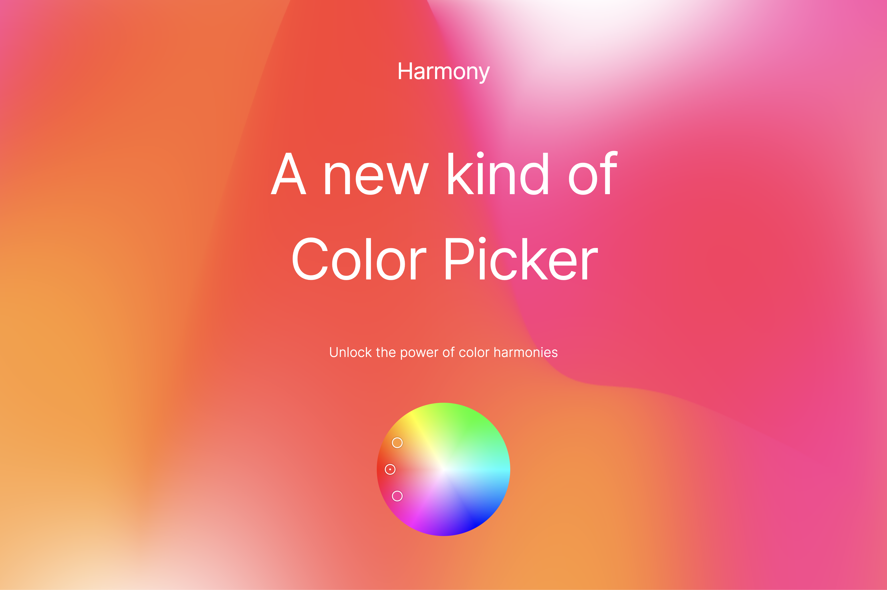

# Harmony

A new kind of Color Picker, which computes harmonic colors along with the primary one. It supports Analogous, Triad, Tetradic, Complementary & Square harmonies.

[Read more about the implementation here.](https://polar.sh/emilwidlund/posts/a-new-kind-of-color-picker-with-react-typescript)

### Installation

Harmony is available on the npm registry. It requires React as a peer dependency.

`pnpm install @newfrgmnt/harmony`

### API

```typescript
import {ColorWheel} from '@newfrgmnt/harmony';

export const MyColorPicker = () => {
    return (
        <ColorWheel harmony="analogous" radius={200} />
    );
}
```

#### Supported properties

```typescript
radius: number;
harmony: 'tetradic' | 'triad' | 'analogous' | 'square' | 'complementary';
color?: {hue: number, saturation: number, value: number};
defaultColor?: {hue: number, saturation: number, value: number};
onChange?: (colors: { hue: number; saturation: number; value: number }[]) => void;
```

#### Convert the HSV format to RGB

You can use the following function to convert the HSV output to RGB.

```typescript
function HSVtoRGB(h: number, s: number, v: number) {
  var r, g, b, i, f, p, q, t;
  h = h / 360;
  i = Math.floor(h * 6);
  f = h * 6 - i;
  p = v * (1 - s);
  q = v * (1 - f * s);
  t = v * (1 - (1 - f) * s);
  switch (i % 6) {
    case 0:
      (r = v), (g = t), (b = p);
      break;
    case 1:
      (r = q), (g = v), (b = p);
      break;
    case 2:
      (r = p), (g = v), (b = t);
      break;
    case 3:
      (r = p), (g = q), (b = v);
      break;
    case 4:
      (r = t), (g = p), (b = v);
      break;
    case 5:
      (r = v), (g = p), (b = q);
      break;
  }
  return {
    r,
    g,
    b,
  };
}
```